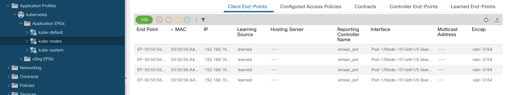

# ACI Containers Demo
###### Cisco Data Center Partner VT - October 2019
<hr>

### Environment

##### Kubernetes

Our Kubernetes cluster is made of 4 nodes, 3 of them are [worker](https://kubernetes.io/docs/concepts/architecture/nodes/) nodes which means this is where my containerized applications will run:

```bash
➜  ~ > kubectl get nodes -o wide
NAME                         STATUS   ROLES    AGE     VERSION   INTERNAL-IP      EXTERNAL-IP      OS-IMAGE             KERNEL-VERSION      CONTAINER-RUNTIME
emear-pvt-masterb99148dab8   Ready    master   2d21h   v1.12.7   169.254.8.73     192.168.163.10   Ubuntu 18.04.2 LTS   4.15.0-45-generic   docker://17.3.2
emear-pvt-worker593ae69246   Ready    <none>   2d21h   v1.12.7   169.254.11.247   192.168.163.13   Ubuntu 18.04.2 LTS   4.15.0-45-generic   docker://17.3.2
emear-pvt-worker662ba92164   Ready    <none>   2d21h   v1.12.7   169.254.8.140    192.168.163.11   Ubuntu 18.04.2 LTS   4.15.0-45-generic   docker://17.3.2
emear-pvt-workere7f910225b   Ready    <none>   2d21h   v1.12.7   169.254.9.50     192.168.163.12   Ubuntu 18.04.2 LTS   4.15.0-45-generic   docker://17.3.2
```

##### Cisco ACI

We integrated our Kubernetes cluster version 1.12 with an existing fabric in our lab, running Cisco ACI 4.1 software. This is the [compatibility matrix](https://www.cisco.com/c/dam/en/us/td/docs/Website/datacenter/aci/virtualization/matrix/virtmatrix.html), in case you are interested to understand if your Kubernetes cluster and Cisco ACI fabric are ready for the integration.

As first step, we download the *acc-provisioning* from [software.cisco.com](https://software.cisco.com) and execute it. It will create a number of objects in APIC. Let's have a look.

First of all, a *tenant* is created for your cluster: 


For this tenant, in our example *emear_pvt*, the acc_provisioning also created application profiles, EPGs, contracts and all required 'wiring' to make the integration work:


Kube-nodes is the EPG where all Kubernetes nodes will be placed. You will be able to see the EP name, as well as MAC, IP, Encapsulation, etc.
All pods created in this Kubernetes/Openshift cluster, except system pods, will go by default in the kube-default EPG, implementing cluster-isolation:



For container workloads, ACI performs hardware Load Balancing (L4) for Kubernetes 'Load Balancing' services leveraging Policy Based Redirect.
You can see the "devices" to balance in the *common* tenant -> Services -> L4/L7 -> Devices:


Let's move to Virtual Networking, where we are able to have full visibility of the objects and applications running inside the Kubernetes or Openshift cluster.
In the container domains, pick your kubernetes or Openshift cluster and drill down. You can see the [nodes](https://kubernetes.io/docs/concepts/architecture/nodes/), [namespaces](https://kubernetes.io/docs/concepts/overview/working-with-objects/namespaces/), [services](https://kubernetes.io/docs/concepts/services-networking/service/), [pods](https://kubernetes.io/docs/concepts/workloads/pods/pod-overview/), etc. By clicking one of the objects, you can see its details. In this example, you can see the details of a pod discovered as an ACI endpoint, its IP, name, encapsulation, etc.


Clicking on a service, you can see how inbound traffic is balanced:


Let's move to Kubernetes and inspect our application.
Our sample application has multiple components: a frontend UI and a few backend services. While it's not important to understand how the application works behind the scenes, it's important to highlight that each component is represented by a Kubernetes [deployment](https://kubernetes.io/docs/concepts/workloads/controllers/deployment/) which creates a [replicaset](https://kubernetes.io/docs/concepts/workloads/controllers/replicaset/). Each replicaset is responsible to run a number of pods and [reconciliate](https://speakerdeck.com/thockin/kubernetes-what-is-reconciliation) when the DESIRED state is different than the AVAILABLE pods:

```bash
➜  ~ > kubectl get deployments
NAME           DESIRED   CURRENT   UP-TO-DATE   AVAILABLE   AGE
myhero-app     3         3         3            3           22h
myhero-data    1         1         1            1           22h
myhero-ernst   1         1         1            1           22h
myhero-mosca   1         1         1            1           22h
myhero-ui      2         2         2            2           22h
nginx          1         1         1            1           22h
```

As said, the UI and the backend deployments have multiple replicas (pods). We can see those replicas have been scheduled and run on multiple worker nodes.
We also see that each POD have a a unique IP assigned, out of a pool that is assigned by the [CNI](https://kubernetes.io/docs/concepts/cluster-administration/networking/), in this case 1.5.0.0/16:

```bash
➜  ~ > kubectl get pods -o wide
NAME                            READY   STATUS    RESTARTS   AGE   IP          NODE                         NOMINATED NODE
myhero-app-69cf7d6b89-2kmjs     1/1     Running   0          22h   1.5.0.10    emear-pvt-worker593ae69246   <none>
myhero-app-69cf7d6b89-85hrj     1/1     Running   0          22h   1.5.0.82    emear-pvt-workere7f910225b   <none>
myhero-app-69cf7d6b89-dsgh4     1/1     Running   0          22h   1.5.0.106   emear-pvt-worker662ba92164   <none>
myhero-data-7747855b45-f67nc    1/1     Running   0          22h   1.5.0.81    emear-pvt-workere7f910225b   <none>
myhero-ernst-5956cdd775-cdrhg   1/1     Running   0          22h   1.5.0.9     emear-pvt-worker593ae69246   <none>
myhero-mosca-6b7f6b5589-qvqzg   1/1     Running   0          22h   1.5.0.105   emear-pvt-worker662ba92164   <none>
myhero-ui-699645fd79-8n7vt      1/1     Running   0          22h   1.5.0.107   emear-pvt-worker662ba92164   <none>
myhero-ui-699645fd79-qrjrb      1/1     Running   0          22h   1.5.0.83    emear-pvt-workere7f910225b   <none>
nginx-dbddb74b8-dmz5k           1/1     Running   0          22h   1.5.0.80    emear-pvt-workere7f910225b   <none>
```

Those IPs are in the same network, how are these PODs communicating with each other if they live in different hosts? How external users are going to reach them? The CNI takes care of this aspects. Some CNIs use [VXLAN](https://en.wikipedia.org/wiki/Virtual_Extensible_LAN) to encapsulate POD traffic across the worker nodes, others may use different approaches, for instance VLAN or untagged traffic.
In case of ACI-CNI, the ACI fabric is responsible for the forwarding.

You can check the POD CIDR pool as well as the ACI configuration in Kubernetes here:

```bash
➜  ~ > kubectl get cm -n kube-system aci-containers-config -o=jsonpath='{.data.host-agent-config}'
{
    "log-level": "info",
    "aci-vmm-type": "Kubernetes",
    "aci-vmm-domain": "emear_pvt",
    "aci-vmm-controller": "emear_pvt",
    "aci-vrf": "default",
    "aci-vrf-tenant": "common",
    "service-vlan": 3165,
    "encap-type": "vxlan",
    "aci-infra-vlan": 3967,
    "cni-netconfig": [
        {
            "gateway": "1.5.0.1",
            "routes": [
                {
                    "dst": "0.0.0.0/0",
                    "gw": "1.5.0.1"
                }
            ],
            "subnet": "1.5.0.0/16"
        }
    ]
}
```

The output you've seen is an excerpt of a [configmap](https://kubernetes.io/docs/tasks/configure-pod-container/configure-pod-configmap/), which is mounted by the ACI-CNI containers as a [volume](https://kubernetes.io/docs/concepts/storage/volumes/). The configmap has been generated by the *acc-provisioning* tool, which configured APIC accordingly, based on use inputs during the integration installation process.


Next: [ACI as Load Balancer for Kubernetes External Services](3-load-balancing-ext-kube-services.md)
