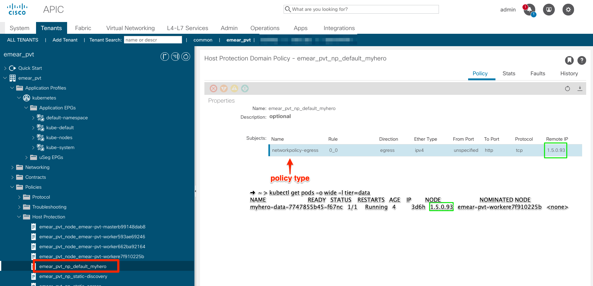

# ACI Containers Demo
###### Cisco Data Center Partner VT - October 2019
<hr>

### Kubernetes Network Policies in ACI

Let's assume our corporate policies mandate that each application needs to run in a dedicated namespace where only application owners have access and that each namespace must be mapped to one EPG.

This is exacly what we've done in the previous step: the network team enforced this behavior and now they need to create contracts to allow cross-application network communication.

However, the application team would like additional policies to be applied in order to deny all unnecessary traffic patterns internal to the application for security reasons. They want to implement this the 'Kubernetes way' and not in ACI, so they move forward with [NetworkPolicies](https://kubernetes.io/docs/concepts/services-networking/network-policies/) directly on Kubernetes.

They want the UI layer to communicate ONLY with the APP layer, which is represented by the *myhero-data* deployment.

The *myhero-data* pods are exposed by a service named *myhero-data*, which listens to TCP port 80.

```bash
➜  ~ > kubectl get svc,deployment -l app=myhero,tier=data
NAME                  TYPE       CLUSTER-IP     EXTERNAL-IP   PORT(S)        AGE
service/myhero-data   NodePort   10.97.194.45   <none>        80:32321/TCP   3d5h

NAME                                DESIRED   CURRENT   UP-TO-DATE   AVAILABLE   AGE
deployment.extensions/myhero-data   1         1         1            1           3d5h
```

They move forward and implement an *egress* NetworkPolicy like the following:

```bash
apiVersion: networking.k8s.io/v1
kind: NetworkPolicy
metadata:
  name: myhero
  namespace: default
spec:
  podSelector:
    matchLabels:
      tier: ui
  policyTypes:
  - Egress
  egress:
  - to:
    - podSelector:
        matchLabels:
          tier: data
    ports:
    - protocol: TCP
      port: 80
```

This network allows egress traffic from pods labeled with *tier=ui* to pods labeled *tier=data* using TCP/80.

The network policy works just fine and is enforced as ACI-CNI fully supports Kubernetes network policies, but... does the network team have visibility on this?

Of course :) All network policies can be seen under the tenant at 'Policies' -> 'Host Protection' as shown below:




Next: [ACI-CNI Operator](https://github.com/rtortori/emear-pvt-aci-containers/blob/master/6-aci-cni-operator.md)