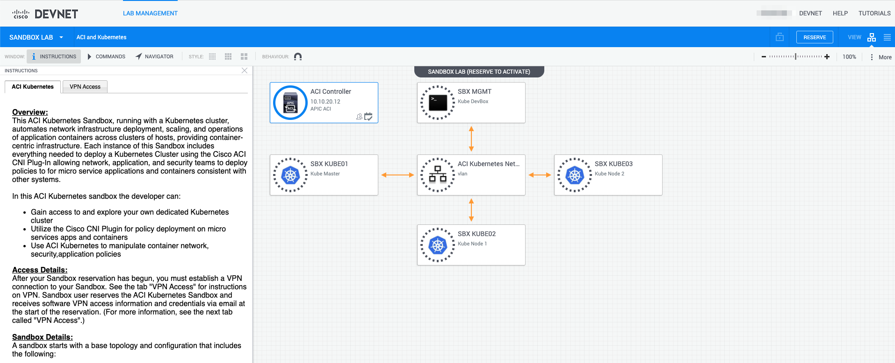

# Cisco Data Center Partner VT - October 2019
## ACI Containers Demo Walkthrough
### Table of contents

1. [Introduction](https://github.com/rtortori/emear-pvt-aci-containers/blob/master/1-intro.md)
2. [Environment](https://github.com/rtortori/emear-pvt-aci-containers/blob/master/2-environment.md)
3. [ACI as Load Balancer for Kubernetes External Services](https://github.com/rtortori/emear-pvt-aci-containers/blob/master/3-load-balancing-ext-kube-services.md)
4. [Workload Network Segmentation](https://github.com/rtortori/emear-pvt-aci-containers/blob/master/4-workload-net-segmentation.md)
5. [Kubernetes Network Policies in ACI](https://github.com/rtortori/emear-pvt-aci-containers/blob/master/5-network-policies.md)
5. [ACI-CNI Operator](https://github.com/rtortori/emear-pvt-aci-containers/blob/master/6-aci-cni-operator.md) 

This demo walkthrough is largely inspired to the Cisco DevNet [ACI and Kubernetes](https://developer.cisco.com/docs/sandbox/#!data-center) sandbox, which offers three different learning paths and eight labs in a dedicated environment you can use at your convenience:

- Option 1: Detailed Learning Lab Walkthrough of Installation, Integration, and Application Deployment (3+ hours of content)

- Option 2: Follow the Quick Start Guide for details on the key steps in installing Kubernetes and the ACI CNI plug-in (about 30 minutes to working cluster)

- Option 3: Run the "auto-deploy" script to prepare and install Kubernetes and the ACI CNI plug-in and immediately have a working cluster. (8 minutes to working cluster)

Next: [Introduction](1-intro.md)